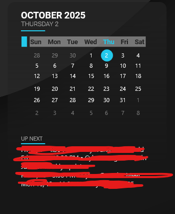

# Sonder NextUp (Rainmeter)
A clean Rainmeter card that shows your next Google Calendar events (“UP NEXT”), styled in the Sonder vibe (dark card, cyan accent).



## What it does
- Pulls your Google Calendar **ICS** feed with a PowerShell script
- Handles timezones (`TZID=…`), UTC `Z`, **all-day events** (`VALUE=DATE`), and folded lines
- Shows the **next 4 events** in a **rolling 7-day** window
- Outputs human-readable lines like: `Fri 10/3 • 4:30 PM • Team Standup`

## Requirements
- Windows 10/11
- [Rainmeter](https://www.rainmeter.net/) (latest)
- Optional (for your desktop aesthetic):  
  - Wallpaper Engine (dark wave video)
  - StartAllBack (taskbar layout/behavior)
  - TranslucentTB (acrylic/blur on desktop; normal when maximized)
- PowerShell 5.1 (built-in on Windows)

## Install (5 minutes)
1. **Copy the skin:**
   - Download/clone this repo.
   - Copy the `Sonder` folder to `Documents\Rainmeter\Skins\`.

2. **Add your secret ICS URL:**
   - Open `Sonder\@Resources\secrets.example.ini`
   - Copy it to `secrets.ini`
   - Paste your **private** Google Calendar ICS URL after `ICS_URL=`
   - ✅ **Do not commit** `secrets.ini` (it’s in `.gitignore`)

3. **Run the fetcher once:**
   ```powershell
   cd "$env:USERPROFILE\Documents\Rainmeter\Skins\Sonder\@Resources"
   powershell -ExecutionPolicy Bypass -File ".\gcal_fetch.ps1"
