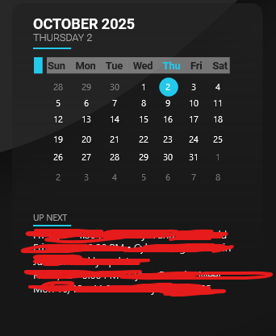

Here’s a drop-in **README.md** you can paste at repo root.

---

# sonder-nextup-rainmeter

Clean “UP NEXT” calendar card for Rainmeter (Sonder vibe: dark card, cyan accent).
It reads your Google Calendar via private **ICS** links, merges multiple calendars, and shows the next **4** events in a rolling **7-day** window.



---

## What you get

* **Sonder/Calendar** skin: compact card with clipped lines, thin divider, cyan date/time.
* **PowerShell fetcher**: robust ICS parser (TZID, UTC “Z”, all-day `VALUE=DATE`, folded lines, RRULE, EXDATE, `RECURRENCE-ID` including `RANGE=THISANDFUTURE`).
* **Multi-ICS**: primary calendar fills the list first, then secondary calendars backfill.
* **No secrets in repo**: ICS URLs loaded from `secrets.ini` (ignored by git).

---

## Requirements

* Windows 10/11
* [Rainmeter](https://www.rainmeter.net/)
* (Optional) [Wallpaper Engine], [StartAllBack], [TranslucentTB] – used in screenshots.

---

## Install (Quick Start)

1. **Get the files**

   * Clone this repo or download the latest release zip and extract it.

2. **Copy the skin**

   * Copy the `Sonder` folder to:
     `C:\Users\<you>\Documents\Rainmeter\Skins\`

3. **Add your calendars (secrets)**

   * In `Sonder\@Resources\`, copy:

     ```
     secrets.example.ini → secrets.ini
     ```
   * Paste your private ICS URL(s). Either:

     ```ini
     # One line, comma or semicolon separated:
     ICS_URLS=https://.../private-AAAA/basic.ics, https://.../private-BBBB/basic.ics
     ```

     or

     ```ini
     ICS_URL=https://.../private-AAAA/basic.ics
     ICS_URL2=https://.../private-BBBB/basic.ics
     ```

4. **Fetch once (test run)**
   Open PowerShell and run:

   ```powershell
   powershell -ExecutionPolicy Bypass -File ".\Sonder\@Resources\gcal_fetch.ps1"
   ```

   This writes `gcal_events.txt` and a log `gcal_log.txt` in `Sonder\@Resources\`.

5. **Load the skin**

   * In Rainmeter, load `Sonder\Calendar\Calendar.ini`, then **Refresh all**.

You should see up to 4 upcoming events formatted like:

```
Fri 10/24 • 12:30 PM • Cyber Ranges x Gavin Judd bi-weekly updates
```

---

## Auto-refresh options

### A) Task Scheduler (recommended)

Two ways:

* **One-command installer**

  ```powershell
  .\scripts\install_task.ps1  -TaskName "Sonder Calendar Fetch" -IntervalMinutes 10
  ```

  Runs at logon and every 10 minutes (edit the number to taste).

* **Import the XML**

  1. Task Scheduler → *Import Task…*
  2. Pick `tools/Sonder-Calendar-Fetch.xml`.
  3. Edit the **Arguments** and **WorkingDirectory** paths if your repo lives somewhere else.
  4. Ensure **Run with highest privileges** is checked.

### B) Rainmeter RunCommand (alternate)

Add a `RunCommand` measure in your skin to trigger every 10 minutes:

```ini
[MeasureFetch]
Measure=Plugin
Plugin=RunCommand
Program=powershell.exe
Parameter=-NoProfile -ExecutionPolicy Bypass -File "#@#\gcal_fetch.ps1"
State=Hide
UpdateDivider=600
```

> Keep either Task Scheduler **or** RunCommand (don’t run both).

---

## Configuration & customization

**Fetcher (PowerShell):** top of `gcal_fetch.ps1`

* `\$MaxItems = 4` – how many lines to show.
* `\$WindowDays = 7` – rolling window length.
* `\$IncludeLocation = \$true | \$false` – append `— Location` to titles.
* Logging is written to `Sonder\@Resources\gcal_log.txt`.

**Skin (Calendar.ini):**

* Accent cyan ≈ `35,201,235` (tweak the color variables at the top).
* Row spacing/width as `#RowHeight#`, `#CardWidth#`.
* Date/time is cyan via `InlinePattern`; titles are white; `ClipString=1`; 12px steps; divider line.
* Hides the card group if line 1 equals `No events in the next 7 days`.

**Priority logic:**

* The **first** ICS in `secrets.ini` is *primary*; it fills up to 4 slots first.
* If slots remain, secondary calendars backfill.
* Final display is always sorted chronologically.

**Optional local filters (for stubborn vendor ghosts):**

```ini
# Hide a single day by summary + date (local)
HIDE_SUMMARY_DAY=Cyber Ranges x Gavin Judd Updates|2025-10-23

# Hide all occurrences from a local date forward
HIDE_SUMMARY_FROM=Gavin / Alfredo Conectado|2024-03-01
```

> These are last-resort, local-only safeguards; do not commit `secrets.ini`.

---

## Repo layout

```
sonder-nextup-rainmeter/
├─ README.md
├─ LICENSE                     # MIT
├─ .gitignore
├─ .gitattributes
├─ CHANGELOG.md
├─ CONTRIBUTING.md
├─ SECURITY.md
├─ .github/ISSUE_TEMPLATE/
│  ├─ bug_report.yml
│  └─ feature_request.yml
├─ scripts/
│  ├─ run_fetch.ps1
│  └─ install_task.ps1
├─ tools/
│  └─ Sonder-Calendar-Fetch.xml
├─ tests/
│  └─ sample.ics
├─ screenshots/
│  └─ preview.png
└─ Sonder/
   ├─ Calendar/Calendar.ini
   └─ @Resources/
      ├─ gcal_fetch.ps1
      ├─ secrets.example.ini      # users copy → secrets.ini (not tracked)
      └─ (fonts/, images/ optional)
```

---

## Troubleshooting

* **Empty list:**

  * Open `Sonder\@Resources\gcal_log.txt` and read the last 40 lines.
  * Check `secrets.ini` is in `Sonder\@Resources\` and contains valid ICS URLs (not placeholders).
  * Run the fetch manually again (see Quick Start step 4).
  * If using Task Scheduler, confirm the task history and paths (ExecutionPolicy Bypass, correct **Start in** folder).

* **Times look wrong:**

  * We map `TZID=America/New_York` (and other common IANA zones) to Windows IDs.
  * Ensure your Windows time zone is set correctly.

* **Phantom/old recurring instances:**

  * The parser handles `EXDATE`, `RECURRENCE-ID` (incl. `RANGE=THISANDFUTURE`) and adds tolerant fallbacks.
  * If a stubborn item remains due to vendor caching/format quirks, add a local rule in `secrets.ini` (see **Optional local filters**).

* **Rainmeter shows only 1–2 lines:**

  * The fetcher only writes **up to 4** within the next 7 days. If you actually have <4 upcoming events, that’s expected.
  * Otherwise, open `gcal_log.txt` to see which items were filtered (canceled, outside window, or hidden).

---

## Privacy & security

* **Do not share** your private ICS URLs.
* `secrets.ini`, `gcal_events.txt`, and `gcal_log.txt` are **ignored** by git:

  ```
  Sonder/@Resources/secrets.ini
  Sonder/@Resources/gcal_events.txt
  Sonder/@Resources/gcal_log.txt
  ```
* If you accidentally committed a secret, rotate the ICS URL in Google Calendar immediately.

---

## Contributing

PRs are welcome! Please don’t include secrets or runtime files.
See [CONTRIBUTING.md](CONTRIBUTING.md) and open a bug with the tail of `gcal_log.txt` if parsing goes sideways.

---

## License

[MIT](LICENSE) — attribution appreciated.
