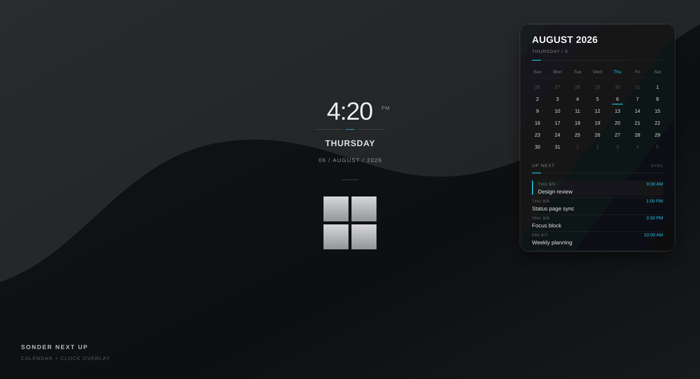

# Sonder Next Up

An independent, unofficial calendar and clock overlay for the [Sonder Rainmeter skin](https://github.com/mpurses/Sonder). It adds a polished desktop agenda, a clean-room center clock, and automatic Google Calendar ICS syncing without an elevated PowerShell window or scheduled task.



[](https://github.com/gavinjudd/sonder-nextup-rainmeter/actions/workflows/validate.yml)

## Highlights

- Up to four genuinely next events in strict chronological order across every configured calendar.
- Rolling seven-day window with all-day events, time zones, folded ICS lines, common recurrence rules, exclusions, moved instances, and cancellations.
- Automatic refresh when the skin loads, after Windows wakes, every five minutes, and whenever **SYNC** is clicked.
- Atomic UTF-16 output so Rainmeter never reads a half-written agenda.
- Refined vector calendar surface and a transparent editorial clock aligned for a centered desktop layout.
- Local-only credentials, metadata-only logs, offline fixture tests, and fail-closed release packaging.

## Requirements

- Windows 10 or 11
- [Rainmeter 4.5 or newer](https://www.rainmeter.net/)
- [Official Sonder](https://github.com/mpurses/Sonder) installed first
- Windows PowerShell 5.1, included with Windows

This repository is deliberately a focused overlay. It does not redistribute Sonder's fonts, settings, plugins, images, or unrelated modules. The Calendar derivative remains under CC BY-NC-SA 3.0; see [Credits and license](#credits-and-license).

## Install

### Option 1: installer

Clone or download this repository, open PowerShell in its root, and run:

```powershell
powershell -NoProfile -ExecutionPolicy Bypass -File .\Scripts\install.ps1
```

The installer:

1. verifies that official Sonder is already installed;
2. backs up every existing overlay file it will replace;
3. copies only this overlay's four public files; and
4. creates `secrets.ini` from the safe example when one does not exist.

It runs as the current user and does not require administrator access.

If your Rainmeter skins are stored somewhere unusual, pass the Sonder folder explicitly:

```powershell
.\Scripts\install.ps1 -SonderPath "D:\Rainmeter\Skins\Sonder"
```

### Option 2: manual copy

Copy each repository source over the matching destination in your installed `Sonder` folder:

| Repository source | Installed destination |
| --- | --- |
| `overlay/Calendar/Calendar.ini` | `Sonder/Calendar/Calendar.ini` |
| `overlay/Clock/Clock.ini` | `Sonder/Clock/Clock.ini` |
| `overlay/@Resources/gcal_fetch.ps1` | `Sonder/@Resources/gcal_fetch.ps1` |
| `overlay/@Resources/secrets.example.ini` | `Sonder/@Resources/secrets.example.ini` |

Do not replace the rest of your official Sonder installation.

## Connect Google Calendar

1. In `Sonder\@Resources`, copy `secrets.example.ini` to `secrets.ini` if the installer did not create it.
2. In Google Calendar, open **Settings and sharing → Integrate calendar**.
3. Copy the **Secret address in iCal format** for each calendar you want to display.
4. Put the private URLs in your local `secrets.ini`:

```ini
ICS_URLS=https://calendar.example/primary.ics;https://calendar.example/secondary.ics
```

The example above is intentionally non-functional. Use the private ICS addresses from your own calendars.

> Treat a private ICS URL like a password. Anyone who has it can read that calendar. Never commit `secrets.ini`, post it in an issue, or include it in a screenshot.

## Load the widgets

1. Open Rainmeter's **Manage** window.
2. Load `Sonder\Calendar\Calendar.ini`.
3. Load `Sonder\Clock\Clock.ini` if you want the redesigned center clock.
4. Click **Refresh all** once after installation.

The calendar launches the fetcher itself. No Task Scheduler entry, administrator terminal, or separate background service is needed.

## How selection works

Every configured feed contributes to one queue:

1. parse and normalize events into local time;
2. reconcile recurring exceptions and cancellations;
3. deduplicate matching events across feeds;
4. keep events in the rolling seven-day window; and
5. sort everything chronologically before taking the first four.

Calendar order in `secrets.ini` is only a stable tie-breaker. It never allows a later event from one feed to displace an earlier event from another.

## Configuration

Fetcher settings are near the top of the installed `Sonder/@Resources/gcal_fetch.ps1` (or `overlay/@Resources/gcal_fetch.ps1` in a source checkout):

```powershell
$DaysAhead       = 7
$MaxItems        = 4
$IncludeLocation = $false
```

Optional local filters belong in `secrets.ini`:

```ini
# Hide one exact title on one local date
HIDE_SUMMARY_DAY=Example appointment|2026-01-15

# Hide an exact recurring title from a local date onward
HIDE_SUMMARY_FROM=Example recurring event|2026-01-15
```

Use the mouse wheel over either widget to adjust its scale. Right-click the clock and choose **Use 12-hour time** or **Use 24-hour time**; its local color variables are documented directly in `Clock.ini`.

### Restore a backup

Before replacing an existing file, the installer copies it to `Sonder\@Resources\Backups\sonder-nextup-YYYYMMDD-HHMMSS` using the same relative path. To roll back, unload the affected widget, copy the desired backup files over the live `Sonder` paths, then refresh Rainmeter. Your existing `secrets.ini` is never replaced.

## Troubleshooting

### The agenda is empty

- Confirm `Sonder\@Resources\secrets.ini` exists and does not contain `example.invalid`.
- Click **SYNC**, wait a few seconds, and refresh the Calendar skin.
- Check that your private ICS address still works in a browser.
- Review `gcal_log.txt`. Current logs contain operational metadata only, but review any file before sharing it publicly.

### The agenda only updates after manual PowerShell

Use the `Calendar.ini` from this repository and remove any legacy scheduled task named `Sonder Calendar Fetch`. The current skin uses Rainmeter's RunCommand plugin and does not need elevation.

### Times are wrong

Make sure Windows has the correct time zone. The parser maps common IANA calendar zones to their Windows equivalents and handles UTC and floating local events.

## Development

For a source checkout, run all repository checks on Windows:

```powershell
powershell -NoProfile -ExecutionPolicy Bypass -File .\Tests\validate_repo.ps1
powershell -NoProfile -ExecutionPolicy Bypass -File .\Tests\test_fetcher.ps1
powershell -NoProfile -ExecutionPolicy Bypass -File .\Tests\test_installer.ps1
powershell -NoProfile -ExecutionPolicy Bypass -File .\Scripts\pack.ps1
```

Release archives are install-only and omit the development fixtures. The source fixture test mocks multiple ICS feeds offline and verifies chronology, partial-download preservation, missing configuration, and empty-calendar behavior.

## Repository layout

```text
overlay/
├─ Calendar/Calendar.ini
├─ Clock/Clock.ini
└─ @Resources/
   ├─ gcal_fetch.ps1
   └─ secrets.example.ini
Scripts/
├─ install.ps1
└─ pack.ps1
Tests/
├─ sample.ics
├─ test_fetcher.ps1
├─ test_installer.ps1
└─ validate_repo.ps1
LICENSES/
└─ CC-BY-NC-SA-3.0.txt
```

## Privacy and security

The repository blocks credentials, fetched ICS data, rendered event output, logs, and atomic-write scratch files. Packaging uses an explicit allowlist and refuses to run if a prohibited tracked path or private Google Calendar URL is detected.

If a private ICS address has ever been published, reset that calendar's secret address in Google Calendar. Deleting a file alone does not revoke the URL.

See [SECURITY.md](SECURITY.md) before attaching diagnostics to an issue.

## Credits and license

This is an independent, unofficial overlay for Sonder by Michael Purses / mpurses. Install and support the [official project](https://github.com/mpurses/Sonder). “Sonder” is used only to identify compatibility; this project is not affiliated with or endorsed by its author.

The original scripts, installer, tests, documentation, preview, and clean-room Clock are MIT licensed. `overlay/Calendar/Calendar.ini` is a modified Sonder Calendar and remains under Creative Commons Attribution-NonCommercial-ShareAlike 3.0 Unported, including its noncommercial and ShareAlike conditions. See [NOTICE.md](NOTICE.md), [LICENSE](LICENSE), and [LICENSES/CC-BY-NC-SA-3.0.txt](LICENSES/CC-BY-NC-SA-3.0.txt).
